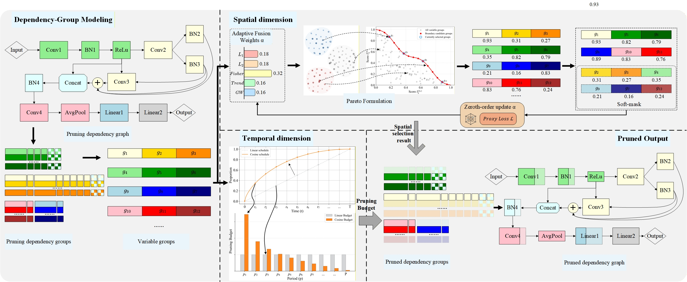

# AdaMCF: Adaptive Multi-Criteria Fusion Pruning

This repository contains model artifacts and reference implementations for **AdaMCF**,
an adaptive multi-criteria fusion framework for structured neural network pruning.

AdaMCF targets the two coupled decisions in structured pruning:

- **What to prune:** dependency-group importance is estimated by fusing multiple
  criteria with loss-guided adaptive weights.
- **When to prune:** a cosine-front sparsification schedule allocates more pruning
  budget to earlier and middle training stages, where networks are generally more
  plastic.

The method is designed for practical structured compression across CNNs, vision
Transformers, object detectors, and pretrained language models.

> 🔗 **Links:** [🤗 Hugging Face Model Hub](https://huggingface.co/AXAIIT/AdaMCF)



## Highlights

- **Adaptive multi-criteria fusion:** combines multiple importance criteria instead
  of relying on a fixed single heuristic.
- **Loss-guided online update:** learns fusion weights through a soft-mask proxy and
  zeroth-order finite-difference estimation.
- **Dependency-group pruning:** removes structurally coupled groups such as filters,
  channels, attention-related units, and model-specific dependency groups.
- **Cosine-front scheduling:** progressively assigns pruning budget according to
  training-stage sensitivity.
- **Broad evaluation:** includes CIFAR-10, CIFAR-100, ImageNet-1K, COCO2017, and
  SQuAD v1.1 experiments.

## Repository Structure

```text
test/
|-- Bert/          # BERT / SQuAD artifacts
|-- Deit-Small/    # DeiT-Small ImageNet artifacts
|-- DenseNet121/   # DenseNet-121 CIFAR-100 artifacts
|-- GoogLeNet/     # GoogLeNet CIFAR-100 artifacts
|-- ResNet18/      # ResNet-18 CIFAR-100 artifacts
|-- ResNet34/      # ResNet-34 CIFAR-100 artifacts
|-- ResNet50/      # ResNet-50 ImageNet artifacts
|-- ResNet56/      # ResNet-56 CIFAR-10 artifacts
|-- ResNet110/     # ResNet-110 CIFAR-10 artifacts
|-- VGG16/         # VGG-16 CIFAR-10 artifacts
`-- YOLOv5L/       # YOLOv5l / COCO2017 artifacts
```

Large model files are tracked with **Git LFS**.

## Included Model Artifacts

The repository includes pruned or fine-tuned artifacts for:

| Task | Dataset | Models |
| --- | --- | --- |
| Image classification | CIFAR-10 | VGG-16, ResNet-56, ResNet-110 |
| Image classification | CIFAR-100 | DenseNet-121, GoogLeNet, ResNet-18, ResNet-34 |
| Image classification | ImageNet-1K | ResNet-50, DeiT-Small |
| Object detection | COCO2017 | YOLOv5l |
| Question answering | SQuAD v1.1 | BERT |

## Reported Results

Selected results from the accompanying paper are summarized below.

| Model | Dataset / Task | Pruned Metric | FLOPs Reduction | Params Reduction |
| --- | --- | ---: | ---: | ---: |
| VGG-16 | CIFAR-10 | 93.02% Top-1 | 70.58% | 94.34% |
| ResNet-56-M | CIFAR-10 | 93.40% Top-1 | 53.53% | 65.73% |
| ResNet-56-H | CIFAR-10 | 93.27% Top-1 | 66.60% | 73.99% |
| ResNet-110-M | CIFAR-10 | 93.51% Top-1 | 66.87% | 79.26% |
| ResNet-18 | CIFAR-100 | 75.86% Top-1 | 62.61% | 75.08% |
| ResNet-34 | CIFAR-100 | 80.05% Top-1 | 78.22% | 87.63% |
| DenseNet-121-H | CIFAR-100 | 79.00% Top-1 | 69.83% | 57.46% |
| GoogLeNet-H | CIFAR-100 | 78.53% Top-1 | 57.57% | 31.18% |
| ResNet-50-M | ImageNet-1K | 75.60% Top-1 | 49.29% | 63.89% |
| ResNet-50-H | ImageNet-1K | 74.49% Top-1 | 79.85% | 74.62% |
| DeiT-Small-M | ImageNet-1K | 79.69% Top-1 | 34.25% | 33.62% |
| DeiT-Small-H | ImageNet-1K | 78.17% Top-1 | 58.21% | 57.16% |
| YOLOv5l | COCO2017 | 64.50 mAP@0.5 | 34.49% | 68.41% |
| BERT | SQuAD v1.1 | 88.11 F1 / 80.68 EM | 33.71% | 33.71% |
| BERT | SQuAD v1.1 | 87.27 F1 / 79.55 EM | 53.93% | 53.94% |

## Git LFS

Clone with Git LFS enabled to retrieve the model weights:

```bash
git lfs install
git clone https://github.com/AXAIIT/AdaMCF.git
cd AdaMCF
git lfs pull
```

Without Git LFS, large files such as `.pt`, `.pth`, `.bin`, and `.th` will be
checked out as pointer files rather than full model weights.

## Method Overview

AdaMCF models structured pruning as a spatio-temporal optimization problem.

In the **spatial dimension**, each dependency group receives multiple importance
signals. The method adaptively fuses these criteria with weights updated by
task-loss feedback, allowing the pruning criterion to change as the model becomes
sparser.

In the **temporal dimension**, AdaMCF uses a cosine-front sparsification schedule
to avoid rigid uniform pruning. This schedule assigns a larger share of pruning
to earlier and middle stages and reduces disruptive structural changes later in
training.

## Citation

If this repository is useful for your work, please cite:

```bibtex
@article{adamcf2026,
  title   = {AdaMCF: Spatio-Temporal Collaborative Structured Pruning via Adaptive Multi-Criteria Fusion},
  author  = {AXAIIT},
  year    = {2026}
}
```

## License

This project is released under the MIT License. See [LICENSE](LICENSE) for
details.
